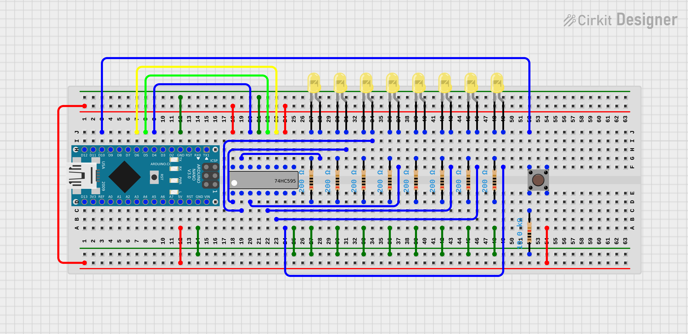

# Assembly

- AVR Assembly language (for ATmega328) project
- Button press switches between (seven) LED patterns
- HW componenrts include:
    - ATmega328 Arduino (nano was used)
    - SIPO shift Register - SN74HC595N (**data** connected to pin **D4**, **clock** connected to pin **D6** and **latch** connected to pin **D5**)
    - 8x (yellow) LEDs
    - Push button (connected to **D12** pin)
    - 8x 220Ω resistor and 1x 10kΩ resistor

## User Manual
- LED pattern "changer"
- Button press changes between seven patterns

## Hardware Setup

## Implementation
Sources are split into 4 files:

1. **Asm.S**: Main loop
    - **R19** - pattern selection
    - **R18** - step in pattern (loop)
    - **R17** - btn check and delay loop
    - **R30** & **R31**/**ZL** & **ZH**/**Z** - loading pattern step (indirect addressing register)
1. **Button.S**: Functions related to button press and release detection
    - **R22** - last btn state
    - **R23** - tmp marker for release
    - **DDRB** - Port B direction register (pin D10 as input pin)
    - **PINB** - Port B status register (for pin D10)
1. **Delay.S**: Delay function using built-in timer0
    - **R20** - data transfer
    - **TCNT0** - Timer/Counter0 register
    - **TIFR0** - Timer/Counter0 Interrupt Flag Register
    - **TCCR0B** - Timer/Counter0 Control Register B    
1. **ShiftRegister.S**: Shift register functionality
    - **R26** - input byte to be shifted
    - **R27** - bit counter (loop)
    - **DDRD** - Port B direction register (pins D4-D6 as output pin)
    - **PORTD** - Port B output register (setting / clearing pins D4-D6)

## Referencess
- [AVR Instruction set](https://onlinedocs.microchip.com/pr/GUID-0B644D8F-67E7-49E6-82C9-1B2B9ABE6A0D-en-US-1/index.html)
- [AVR Instruction set (pdf)](https://ww1.microchip.com/downloads/en/DeviceDoc/AVR-Instruction-Set-Manual-DS40002198A.pdf)

