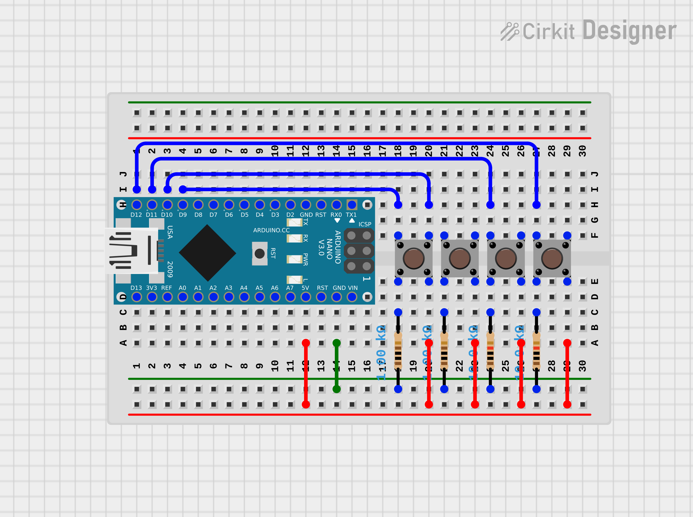
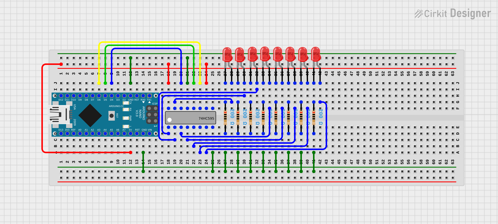
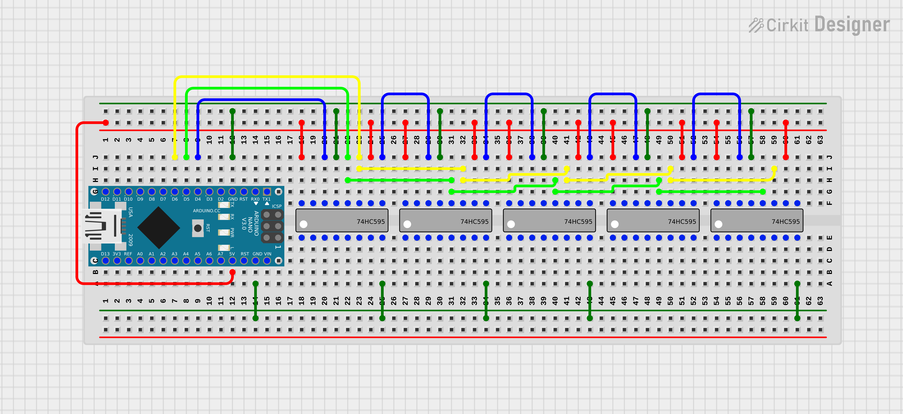
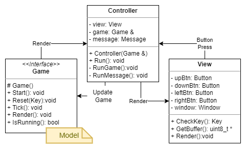
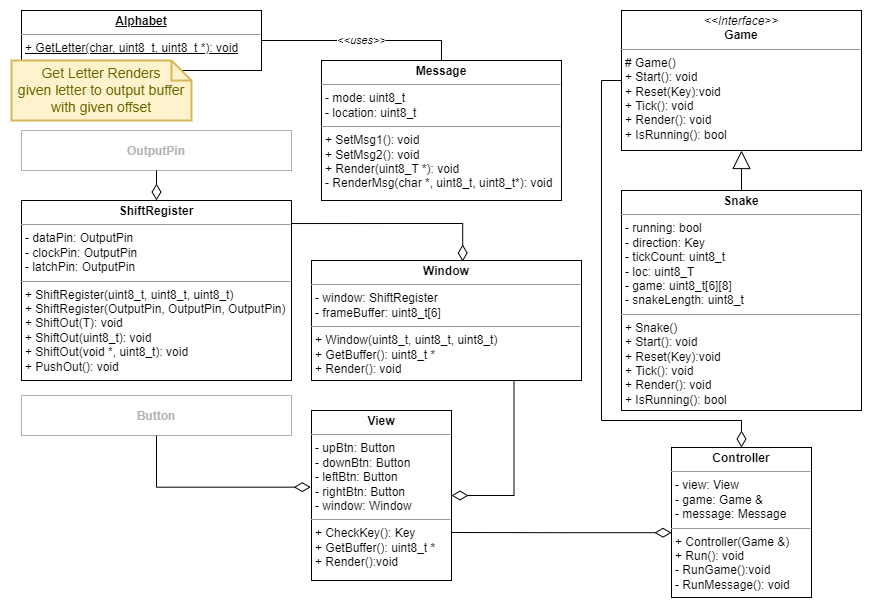

# LED Game - Snake

- Game of snake
- HW componenrts include:
    - Arduino (nano was used)
    - 6x SIPO shift Register - SN74HC595N (**data** connected to pin **D4**, **clock** connected to pin **D6** and **latch** connected to pin **D5**)
    - 24x LEDs
    - 64x 220Ω resistors or 6x 9-pin 220Ω resistor array
    - 4x 10kΩ resistors
    - 4x Push button (connected to **D9** - **D12** pinpins)
    - 9 by 15 prototype PCB board 
    - Cables

## User Manual

After power up, the message "READY" is displayed in a loop.

To start Game, press any button / key

Use appropriate buttons to play the game

After game is over, the "GAME OVER" message is displayed, followed by the "READY" message being displayed in a loop.

To start new game, pres any button, while any message is being displayed

## Hardware Setup

For better clarity, wiring was split into 3 parts:
- Buttons
    - Pin 9: **Right**
    - Pin 10: **Left**
    - Pin 11: **Down**
    - Pin 12: **Up**
- One line of LEDs
- Shift registers chain

### Buttons

### LEDs

### Shift Registers

**NOTE:** Because of limited space, the diagram does not show sixth schift register. The last shift register is wired in the same way as previous shift registers.

## Architecture
### Model-View-Controller (MVC)

### Class Model

## Referencess
See also my [C# Universal Windows Platform implementation](https://github.com/jozef17/UWP-Mini-Games)