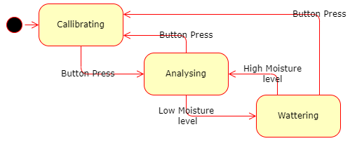

# Arduino-projects
Arduino projects

## libraries
Contains human friendly abstractions 
### Core
Core library contains commonly used includes
### InputDevices

Includes input devices abstractions

- Button
    - Checks for change in state

### Logger

Contains all functionality needed for logging purposes.

- Logger interface
- SerialLogger class
    - Loggs message or number via Arduino's serial interface
    - Bound rate is 9600

### Pin

Contains all functionality related to Arduino's' IO pins

- PinMode is enum representation of Pin Mode (Input, Output or inputPullu)
- Abstract class Pin contains common functionality
- InputPin represents any input pin (both analog and digital) 
    - NOTE: InputPullup not supported yet
    - Reads current value on pin
- OutputPin represents any output pin (both PWM and digital)
    - Writes value to pin

### StepperMotor

Encapsulates functionality needed for stepper motor 28BYJ-48 with driver

- Allows move stepper motor by required amount of steps in required direction
- Note: Changing speed is not yet supported

## Watering System
- Automated wattering system
- (WIP) Includes automatic callibration / re-callibration
- (WIP) 2 status indicating LEDs
- (WIP) Button press switches between callibration and wattering mode
- HW componenrts include:
    - Arduino (nano)
    - Soil Moisture sensor (connected to A0 pin)
    - 1 channel 5v relay module (connected to D10 pin)
    - Water pump (connected to relay)
    - (WIP) Yellow (connected to D2 pin) and green (connected to D3 pin) LEDs
    - (WIP) Push button (connected to D12 pin)

### State Machine

- Implemented as State Pattern
- Three States:
    - (WIP) Callibrating
    - Analysing
    - Wattering

TODO: class diagram
TODO: class description