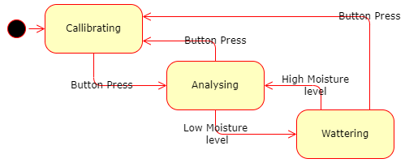
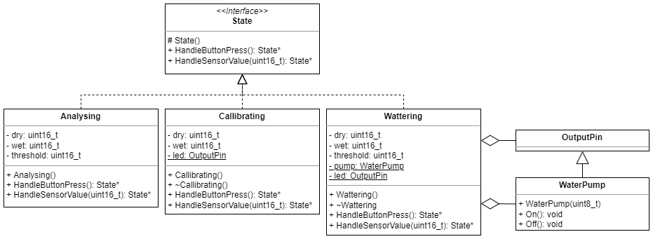

# Arduino-projects
Arduino projects

## libraries
Contains human friendly abstractions 
### Core
Core library contains commonly used includes
### InputDevices
Includes input devices abstractions
- Button
    - Checks for change in state
### Logger
Contains all functionality needed for logging purposes.
- Logger interface
- SerialLogger class
    - Loggs message or number via Arduino's serial interface
    - Bound rate is 9600
### Pin
Contains all functionality related to Arduino's' IO pins
- PinMode is enum representation of Pin Mode (Input, Output or inputPullu)
- Abstract class Pin contains common functionality
- InputPin represents any input pin (both analog and digital) 
    - NOTE: InputPullup not supported yet
    - Reads current value on pin
- OutputPin represents any output pin (both PWM and digital)
    - Writes value to pin
### StepperMotor
Encapsulates functionality needed for stepper motor 28BYJ-48 with driver
- Allows move stepper motor by required amount of steps in required direction
- Note: Changing speed is not yet supported

## Watering System
- Automated wattering system
- Includes callibration / re-callibration
- 2 status indicating LEDs
- Button press switches between callibration and wattering mode
- HW componenrts include:
    - Arduino (nano)
    - Soil Moisture sensor (connected to A0 pin)
    - 1 channel 5v relay module (connected to D10 pin)
    - Water pump (connected to relay)
    - (WIP) Yellow (connected to D2 pin) and green (connected to D3 pin) LEDs
    - (WIP) Push button (connected to D12 pin)

TODO: Callibrating.gif
TODO: Wattering.gif

### State Machine

- Implemented as State Pattern
- Three States:
    - Callibrating
    - Analysing
    - Wattering

### Class Model

- Abstract class State represents state pattern interface.
- Analysing class represents analysing state. Checks if soil needs wattering.
- Callibrating class represents analysing state. Gets values for dry and wet sensor.
- Wattering class represents analysing state. Pump is on until soil is wet enough.
- WaterPump cvlass is abstraction of pump.
