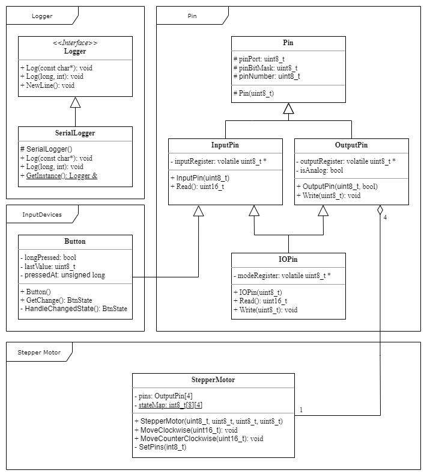

# Arduino-projects
Arduino projects

## libraryes
Contains user friendly abstractions 
### Core
Core library contains commonly used includes
### Logger
Contains all functionality needed for logging purposes.
- Logger interface
- SerialLogger class
-- Loggs message or number via Arduino's serial interface
-- Bound rate is 9600
### Pin
Contains all functionality related to Arduino's' IO pins
- PinMode is enum representation of Pin Mode (Input, Output or inputPullu)
- Abstract class Pin contains common functionality
- InputPin represents any input pin (both analog and digital) 
-- NOTE: InputPullup not supported yet
-- Reads current value on pin
- OutputPin represents any output pin (both PWM and digital)
-- Writes value to pin
### StepperMotor
Encapsulates functionality needed for stepper motor 28BYJ-48 with driver

