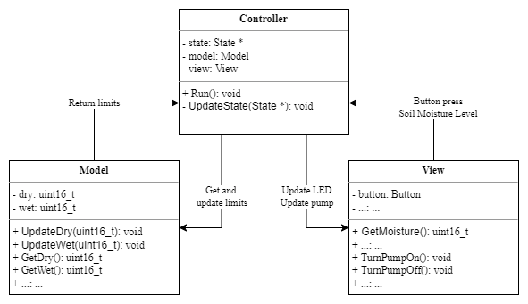
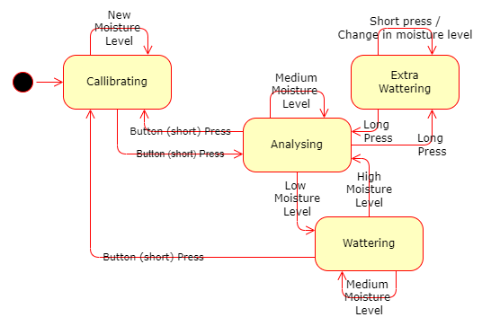
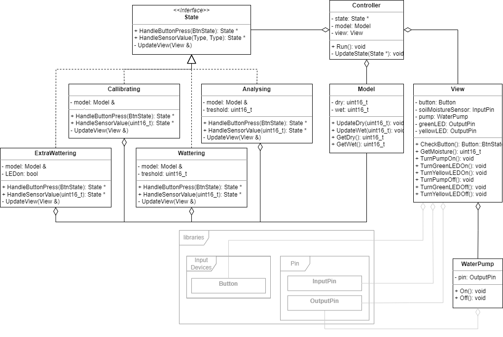

# Watering System

- Automated wattering system
- Includes callibration / re-callibration
- 2 status indicating LEDs
- Button press switches between callibration and wattering mode
- HW componenrts include:
    - Arduino (nano was used)
    - Soil Moisture sensor (connected to A0 pin)
    - 1 channel 5v relay module (connected to D10 pin)
    - Water pump (connected to relay module)
    - Yellow (connected to D2 pin) and green (connected to D3 pin) LEDs
    - Push button (connected to D12 pin)
    - 2x 220Ω resistor and 1x 10kΩ resistor

## User Manual

### LED indicators
- <B>Yellow LED ON</B> - System is in callibrating mode 
- <B>Green LED ON</B> - Soild detected too dry and watering is in progress
- <B>All LEDs OFF</B> - Soil is suffciently wet

### Setup (Calibrating)
Since different soil moisture sensor produce vales from different range, callibration ensures the right limits are taken into account.

After powering on, system is set to calibrating mode:
1. Submerge the soil moisture sensor in water as much as possible (getting the "wet" value)
2. Take the soil moisture sensor out of water and dry it as much as possible (getting the "dry" value)
3. Put the soil moisture into the soil
4. Press the button.

### Watering 
When system detect that soil is too dry, watering automatically turns on. 

**NOTE: Make sure you have enough water in the tank**

### Re-calibrating

By pressing button at any time, system goes to callibrating mode (see Setup section)

## Hardware Setup

## Architecture
### Model-View-Controller (MVC)

**Model**
- Contains data for watering

**View**
- Controlls UI indicators (LEDs & Water pump)
- Detect input devicess (Button and Soil Moisture Sensor)

**Controller**
- Handles state machine

### State Machine

- Implemented as State Pattern
- Three States:
    - Callibrating
    - Analysing
    - Wattering

### Class Model

