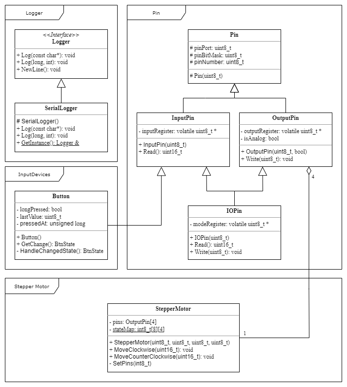

# libraries
Contains human friendly abstractions 
## Core
Core library contains commonly used includes
## InputDevices
Includes input devices abstractions
- Button
    - Distinguishes five states: **No Change**, **Pressed**, **Released**, **Long Pressed** and **Long Released**
## Logger
Contains all functionality needed for logging purposes.
- Logger interface
- SerialLogger class
    - Loggs message or number via Arduino's serial interface
    - Bound rate is **9600**
## Pin
Contains functionality related to Arduino's IO pins
- Abstract class Pin contains common functionality
- Uses registers to set and read digital values
- InputPin represents any input pin (both analog and digital)     
    - Reads current value on pin
- OutputPin represents any output pin (both PWM and digital)
    - Writes value to pin
- IOPin enables to switch between input and output of given pin
## StepperMotor
Encapsulates functionality needed for stepper motor 28BYJ-48 with driver
- Allows move stepper motor by required amount of steps in required direction
- **Note: Changing speed is not yet supported**

